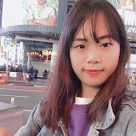

I am a Master's candidate in the College of Human Computer Science (HCI) and a member of [Data Science Lab](ds.hanyang.ac.kr) at Hanyang University, Rep. of Korea.

My research focus is on understanding how people share news, content or interests on online environment with large-scale data. I am currently interested in interactions among online communities, especially in the K-pop fan communities.

- Research Interests: **`Computational Social Science`** / **`Data Journalism`** / **`Application of Artificial Intelligence`**
- Contact: [jiwonkang@hanyang.ac.kr](mailto:jiwonkang@hanyang.ac.kr)

---

## Education

- **Hanyang University, Seoul, Rep. of Korea: 2018 - Present**

  - Master's in College of HCI

  - *Advisors:* Dr. Jinyoung Han

- **Hongik University, Seoul, Rep. of Korea: 2012 - 2017**

  - Bachelor’s in Law and Korean Language & Literature

---

## Publications

**[2019]**

- **"Who Drives Successful Online Conversations? Unveiling the Role of First User Response,"** Ye-eun Won, **Jiwon Kang (co-author)**, Daejin Choi, Eunil Park, and Jinyoung Han*, Kybernetes , accepted.
- **"Understanding Customers' Hotel Revisiting Behaviour: A Sentiment Analysis of Online Feedback Reviews,"** Eunil Park, **Jiwon Kang**, Daejin Choi, and Jinyoung Han*, Current Issues in Tourism, 1-7.
- **"Alliance for My Idol: Analyzing the K-pop Fandom Collaboration Network,"** **Jiwon Kang**, Minsung Lee, Eunil Park, Minsam Ko, Munyoung Lee, and Jinyoung Han*, ACM CHI Conference on Human Factors in Computing Systems (CHI), Glasgow, Scotland UK, May 2019. (6pg. extended abstract) [\[html\]](https://dl.acm.org/ft_gateway.cfm?id=3312906&ftid=2058735&dwn=1&CFID=138429176&CFTOKEN=25571f577f33a319-E7563BBA-9739-CC77-E47672DA81A452D0) [\[poster\]](resources/chi19lbwPoster.pdf)
- **"A Deep Neural Network Model for Identifying Political Party based on Face Images,"** Jeewoo Yoon, **Jiwon Kang**, Seunghoon Jeong, Minsam Ko, Eunil Park, and Jinyoung Han*, HCI Korea 2019, Jeju, Feb. 2019. (Korean)
- **"An Analysis of Socio-Economic Behavior in Me-Media,"** Migyeong Yang, **Jiwon Kang**, Eunil Park, Minsam Ko, and Jinyoung Han, HCI Korea 2019, Jeju, Feb. 2019. (Korean)
- **"Effects of Initial Comments on Successful Online Conversation,"** Ye-eun Won, **Jiwon Kang**, Eunil Park, Minsam Ko, Ki Joon Kim, and Jinyoung Han, HCI Korea 2019, Jeju, Feb. 2019. (Korean)

**[2018]**

- **"Understanding Influential Comments in Online Conversations,"** **Jinwon Kang**, Daejin Choi, Eunil Park, and Jinyoung Han*, ACM Conference on Computer-Supported Cooperative Work and Social Computing (CSCW), Jersey City, USA, November 2018. (4pg. extended abstract). [\[pdf\]](https://dl.acm.org/ft_gateway.cfm?id=3274054&ftid=2013754&dwn=1&CFID=138429312&CFTOKEN=ba322ba82af714e2-E75B9845-95A9-C5B9-28925087EAC4ACBB) [\[poster\]](resources/cscw18eaPoster.pdf)
